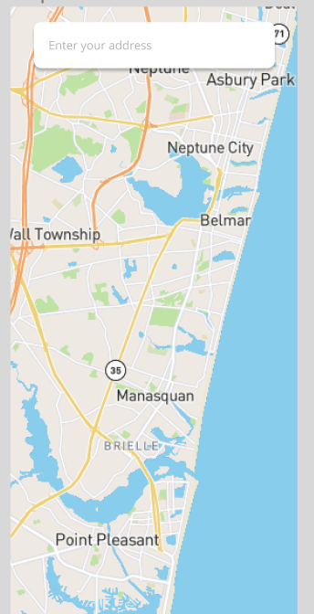

# HackNJIT
fishing-stop

  
  
  

# Introducing Fish Book: Your Ultimate Guide to America's Premier Fishing Spots
[Screenshot 2023-11-05 112949](https://github.com/kyrollos2/HackNJIT/assets/149887130/fab43597-4057-43f1-ad23-da65cbda31a5)

Fish Book is the definitive app for passionate fishermen across the United States. This app helps fishermen explore prime fishing!

 locations and share their love for angling. Discover the nation's top fishing spots, access real-time weather updates and precise GPS coordinates, and engage with a vibrant fishing community.
 

 
Discover Top Fishing Spots: Explore carefully selected locations for an unforgettable angling experience.

Real-time Weather Updates: Stay prepared with accurate weather forecasts and conditions.

Precise GPS Coordinates: Navigate directly to your chosen spot with latitude and longitude details.

Community-Powered Catches: Share your successes and explore fellow anglers' catches, fostering camaraderie.

FishFinder is your community-driven angling companion. Download now and embark on a journey to America's finest fishing spots.

Note: FishFinder requires an internet connection for real-time updates and community interactions.

# technology used in the process 

FIGMA: we used figma to make the front end of the FISHBOOK app

ProstgreSQL: Using object-oriented features of PostgreSQL, programmers can: Communicate with the database servers using objects in their code. Define complex custom data types.

Google Maps API: The Geocoding API is a service that accepts a place as an address, latitude and longitude coordinates, or Place ID. It converts the address into latitude and longitude coordinates and a Place ID, or converts latitude and longitude coordinates or a Place ID into an address.

AWS Relational Database services: Amazon Relational Database Service (Amazon RDS) is a collection of managed services that makes it simple to set up, operate, and scale databases in the cloud.

AWS EC2: Amazon Elastic Compute Cloud (Amazon EC2) is a web service that provides secure, resizable compute capacity in the cloud. It is part of Amazon Web Services (AWS)

# Data

import psycopg2  """Import using a import psycopg2 statement so you can communicate with the PostgreSQL database."""

